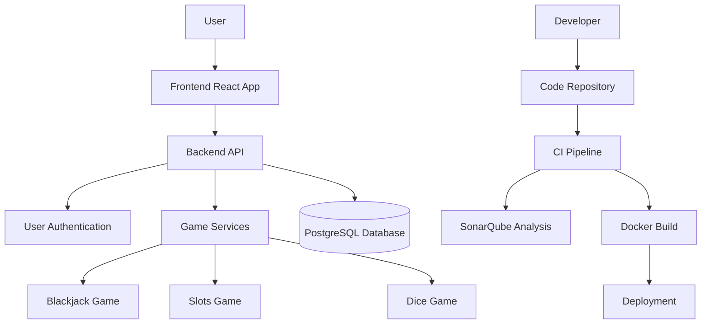
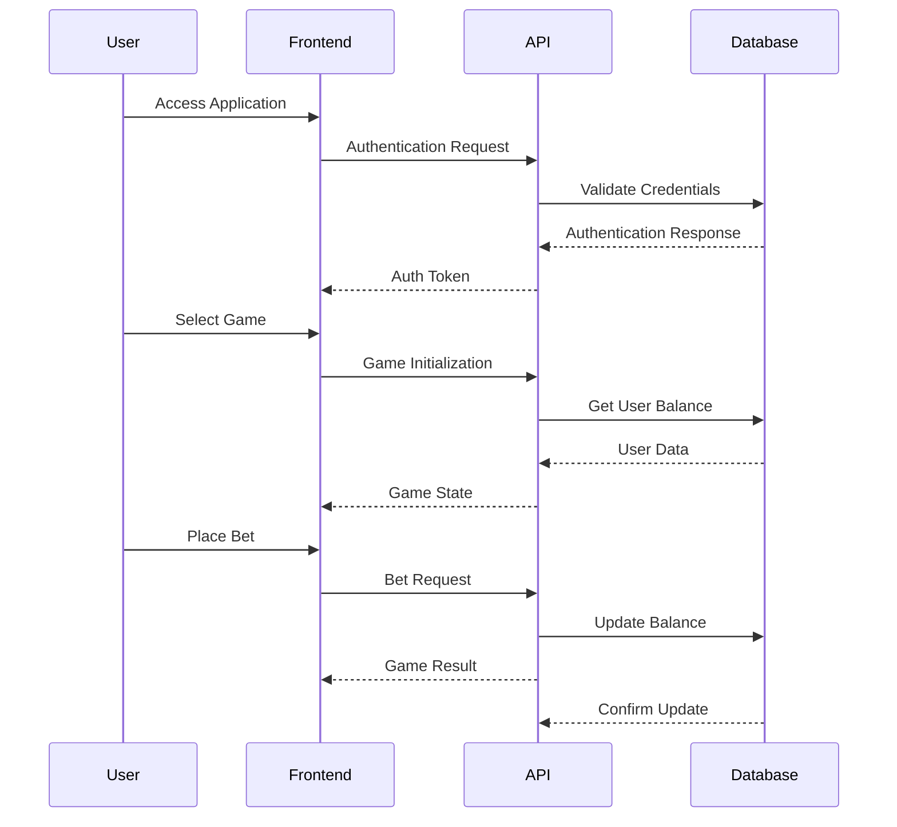

<h1 align='center'>FEPsino</h1> 

<p align='center'>
  
  
  
  
  
  
  
</p>

---

## Table of Contents
- [Overview](#overview)
- [Components](#components)
- [Architecture](#architecture)
  - [Architecture Diagram](#architecture-diagram)
  - [Architecture Characteristics](#architecture-characteristics)
- [Getting Started](#getting-started)
- [SonarQube Integration](#sonarqube-integration)
- [Environment Configuration](#environment-configuration)
- [Usage](#usage)
- [Development](#development)

---

## Overview

FEPsino is a comprehensive online casino platform that offers multiple games including BlackJack, Slots, and Dice. The project is built as a modern web application with a focus on scalability, maintainability, and user experience.

Key features:
- Multiple casino games with realistic gameplay
- User account management with balance tracking
- Responsive design for desktop and mobile devices
- Fully containerized architecture for easy deployment
- Integrated code quality analysis

The application leverages modern technologies such as Django REST Framework for the backend API, React for the frontend UI, PostgreSQL for data persistence, and Docker for containerization. SonarQube is integrated for continuous code quality monitoring.

---

## Components

FEPsino consists of several key components:

### Backend Components
- **Core**: Central configuration and settings for the Django application
- **User**: User authentication, registration, and profile management
- **Game Modules**:
  - **BlackJack**: Game logic and API endpoints for the BlackJack game
  - **Slots**: Game logic and API endpoints for the Slots game
  - **Dice**: Game logic and API endpoints for the Dice game

### Frontend Components
- **User Interface**: React components for navigation, user authentication, and game selection
- **Game Components**: Specialized React components for each game type
- **Animation Components**: Reusable animation effects for enhanced user experience

### Infrastructure Components
- **PostgreSQL Database**: Persistent storage for user data and game statistics
- **SonarQube**: Code quality analysis and reporting
- **Docker**: Containerization for consistent deployment across environments

---

## Architecture

FEPsino follows a modern microservices-inspired architecture with clear separation of concerns between frontend and backend components.

### Architecture Diagram



### System Interaction Diagram



### Architecture Characteristics

| Characteristic  | Rating (1-5) | Description                                                   |
|-----------------|--------------|---------------------------------------------------------------|
| Deployability   | ★★★★★        | Fully containerized with Docker for easy deployment           |
| Elasticity      | ★★★☆☆        | Can scale horizontally but requires manual configuration      |
| Evolutionary    | ★★★★☆        | Modular design allows for easy addition of new games          |
| Fault tolerance | ★★★☆☆        | Basic error handling but limited automatic recovery           |
| Modularity      | ★★★★★        | Clear separation between components and services              |
| Overall cost    | ★★★★☆        | Low infrastructure requirements with efficient resource usage |
| Performance     | ★★★★☆        | Optimized for responsive gameplay with minimal latency        |
| Reliability     | ★★★★☆        | Stable operation with proper error handling                   |
| Scalability     | ★★★★☆        | Can handle increased load through horizontal scaling          |
| Simplicity      | ★★★★☆        | Clean architecture with intuitive component organization      |
| Testability     | ★★★★★        | Comprehensive test coverage with SonarQube integration        |

#### Detailed Architecture Characteristics Analysis

**Deployability (★★★★★)**: FEPsino achieves maximum deployability through its comprehensive Docker containerization strategy. The entire application stack—including frontend, backend, database, and SonarQube—is defined in the docker-compose.yml file, enabling one-command deployment across any environment. This approach eliminates "works on my machine" issues and significantly reduces deployment time from hours to minutes, making it ideal for both development and production environments.

**Elasticity (★★★☆☆)**: The system scores moderately on elasticity as it supports horizontal scaling of both frontend and backend components, but lacks automated scaling mechanisms. While the containerized architecture allows for adding more instances manually, the absence of orchestration tools like Kubernetes or auto-scaling policies prevents it from achieving higher elasticity. This design choice balances complexity against the current scale requirements of the application.

**Evolutionary (★★★★☆)**: FEPsino's architecture earns four stars for evolutionary capability due to its modular design that isolates game logic into separate components. New games can be added with minimal changes to existing code, following the established pattern of game modules. The system falls short of five stars only because some cross-cutting concerns like user balance management require careful coordination across modules when evolving the system.

**Fault Tolerance (★★★☆☆)**: The three-star rating for fault tolerance reflects the system's basic error handling capabilities without sophisticated recovery mechanisms. While the application implements proper exception handling and transaction management to prevent data corruption, it lacks advanced features like circuit breakers, automatic failover, or self-healing capabilities. This level is appropriate for the application's current needs but could be enhanced for mission-critical deployments.

**Modularity (★★★★★)**: The perfect score in modularity is justified by the clean separation of concerns throughout the architecture. Each game is implemented as an independent module with well-defined interfaces, the frontend and backend are completely decoupled, and infrastructure components are isolated. This high modularity enables parallel development by different team members and simplifies maintenance by containing changes within specific modules.

**Overall Cost (★★★★☆)**: FEPsino achieves excellent cost efficiency through its containerized architecture that minimizes resource requirements and allows for precise allocation of computing resources. The use of open-source technologies eliminates licensing costs, while the efficient database design reduces storage needs. The system falls short of five stars only because the development environment includes SonarQube, which increases resource consumption during development.

**Performance (★★★★☆)**: The four-star performance rating is achieved through several optimizations: efficient API design that minimizes network overhead, React's virtual DOM for responsive UI updates, and database query optimization. The architecture supports low-latency gameplay essential for a satisfying casino experience. The system doesn't receive five stars because it prioritizes maintainability and clarity over absolute performance in some areas, a reasonable trade-off for this application domain.

**Reliability (★★★★☆)**: FEPsino's reliability rating is based on its robust error handling, data validation, and transaction management that ensure consistent system behavior even under unexpected conditions. The containerized architecture provides isolation that prevents cascading failures. The four-star rating acknowledges that while the system handles most error scenarios gracefully, it lacks some advanced reliability features like comprehensive retry policies or distributed tracing.

**Scalability (★★★★☆)**: The architecture earns four stars for scalability through its stateless backend design, separation of concerns, and efficient database access patterns. The system can handle increasing user loads by adding more container instances of the frontend or backend components. The rating reflects that while horizontal scaling is supported, some manual configuration is required, and the database might become a bottleneck under extreme loads without additional partitioning strategies.

**Simplicity (★★★★☆)**: The four-star simplicity rating reflects the architecture's intuitive organization and clear component boundaries that make it easy for new developers to understand and contribute to the project. The consistent patterns used across game modules and the well-documented API reduce cognitive load. The system doesn't achieve five stars because some advanced features like the betting system introduce necessary complexity that requires deeper understanding.

**Testability (★★★★★)**: FEPsino excels in testability with its five-star rating due to several factors: the modular architecture naturally supports unit testing of isolated components, the clear API boundaries enable comprehensive integration testing, and the SonarQube integration provides continuous code quality and test coverage monitoring. The separation of frontend and backend also allows for independent testing of each layer, resulting in a highly testable system that maintains quality as it evolves.

**Partitioning Type**: Technically partitioned by functionality (games, user management, etc.)

**Number of Quanta**: 5 (Frontend, Backend API, Database, SonarQube, Game Services)

### Architecture Decisions

The architecture of FEPsino was designed with the following considerations:

1. **Separation of Frontend and Backend**: Clear separation allows independent development and scaling of each component.

2. **Containerization**: Docker provides consistency across development and production environments, simplifying deployment.

3. **Modular Game Design**: Each game is implemented as a separate module, allowing for independent development and maintenance.

4. **REST API**: The backend exposes a RESTful API for the frontend to consume, providing a clean interface between components.

5. **Continuous Quality Monitoring**: Integration with SonarQube ensures code quality is maintained throughout development.

---

## Getting Started

### Prerequisites
- Docker and Docker Compose
- Git

### Installation

1. Clone the repository:
```bash
git clone https://github.com/yourusername/fepsino.git
cd fepsino
```

2. Create a `.env` file in the root directory (see [Environment Configuration](#environment-configuration))

3. Build and start the containers:
```bash
docker-compose up --build
```

4. Access the application:
   - **Backend API**: http://localhost:8000
   - **Frontend**: http://localhost:5173
   - **SonarQube**: http://localhost:9000

### Running the Application

After the initial build, you can start the application with:

```bash
docker-compose up
```

To stop the application:

```bash
docker-compose down
```

---

## SonarQube Integration

FEPsino integrates SonarQube for continuous code quality analysis. SonarQube helps identify code smells, bugs, vulnerabilities, and test coverage issues.

### Accessing SonarQube

Once the application is running, SonarQube is available at:
```
http://localhost:9000
```

Default credentials (if not changed in .env):
- Username: admin
- Password: admin

### Running SonarQube Analysis Manually

To manually trigger a SonarQube analysis:

```bash
docker-compose up sonarscanner
```

### Key Metrics Monitored

- Code coverage
- Duplicated code
- Code smells
- Bugs and vulnerabilities
- Technical debt

---

## Environment Configuration

Create a `.env` file in the root directory with the following variables:

```bash
# Django Secret Key
SECRET_KEY=your-secret-key

# Database Configuration
DB_HOST=db
DB_NAME=dbname
DB_USER=username
DB_PASS=userpass

# SonarQube Configuration
SONAR_HOST_URL=http://sonarqube:9000
SONAR_PROJECT_KEY=fepsino
SONAR_PROJECT_NAME=FEPsino
SONAR_TOKEN=your-sonar-token

SONAR_JDBC_URL=jdbc:postgresql://db:5432/sonar
SONAR_JDBC_USERNAME=sonar
SONAR_JDBC_PASSWORD=sonar-password

# Frontend Configuration
VITE_API_URL=http://localhost:8000/api
```

Replace the placeholder values with your actual configuration.

---

## Usage

### User Registration and Login

1. Navigate to the homepage at http://localhost:5173
2. Click on "Sign Up" to create a new account
3. After registration, log in with your credentials

### Playing Games

1. After logging in, you are navigated to the homepage
2. Choose from available games:
   - BlackJack
   - Slots
   - Dice
3. Each game has its own instructions and betting options

### Managing Your Account

1. Access your profile by clicking on your username
2. View your balance and transaction history
3. Update your profile information as needed

---

## Development

### Project Structure

```
fepsino/
├── backend/               # Django backend
│   ├── core/              # Core settings and configuration
│   ├── user/              # User management
│   ├── blackjack/         # BlackJack game logic
│   ├── slots/             # Slots game logic
│   ├── dice/              # Dice game logic
│   └── scripts/           # Utility scripts
├── frontend/              # React frontend
│   ├── src/
│   │   ├── components/    # React components
│   │   ├── assets/        # Static assets
│   │   └── tests/         # Frontend tests
│   └── public/            # Public assets
└── docker-compose.yml     # Docker configuration
```
